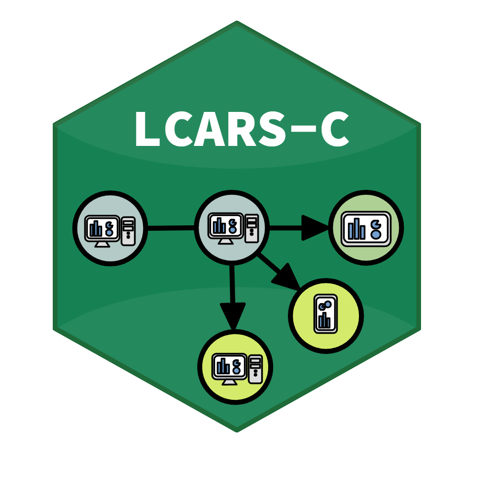

<!-- README.md is generated from README.Rmd. Please edit that file -->

```{r, include = FALSE}
knitr::opts_chunk$set(
  collapse = TRUE,
  comment = "#>",
  fig.path = "man/figures/README-",
  out.width = "100%"
)
```

# LCARS-C 

LCARS-C is a lightweight clinical data acquisition and management software for clinical research and other data-focused research projects.

## Installation

Install from github:

``` r
install.packages("devtools")
devtools::install_github("hcstubbe/lcarsc")
```

Alternatively, clone this repository and install lcarsc from the repository's base folder including the lcarsM dependency:

``` r
install.packages("devtools")
devtools::install_local("dependencies/lcarsM.tar.gz")
devtools::install_local()
```


## Example

Using LCARS-C locally: In this example, the config and scientific databases are saved in the working directory as 'db_test_data.sqlite3.sqlite3' and 'db_test_cfg.sqlite3.sqlite3'. The preview data is saved as 'db_preview.sqlite3'. 'db_preview.sqlite3' is overwritten each time the software reboots or the page reloads.

```{r example, eval=FALSE, include=TRUE}
library(lcarsc)
lcarsc::run_app(ecrf_database_driver = RSQLite::SQLite(),
        ecrf_dbhost = "dbtest",
        ecrf_dbname = "db_test_data.sqlite3",
        ecrf_dbuser = "test_user",
        ecrf_dbpassword = NULL,
        config_database_driver = RSQLite::SQLite(),
        config_dbpassword = NULL,
        config_dbhost = "dbtest",
        config_dbname = "db_test_cfg.sqlite3",
        config_dbuser = "test_user",
        options = list(host = '0.0.0.0', port = 3838))
```
